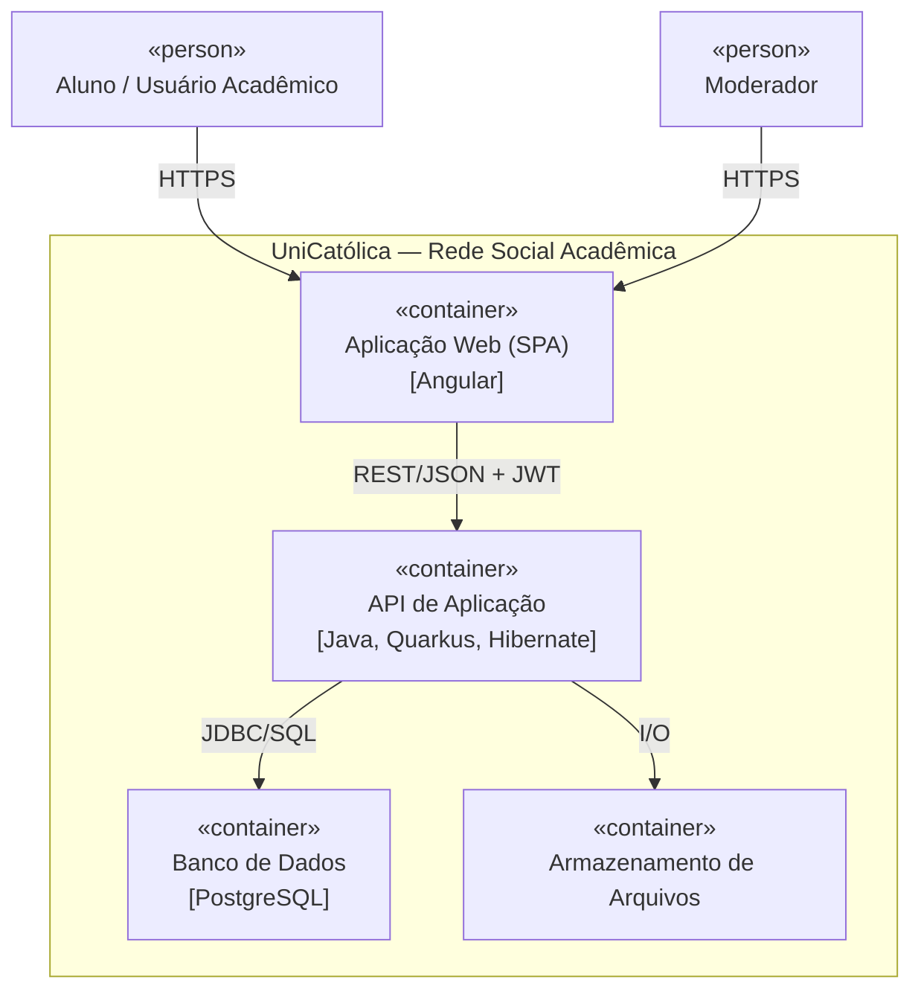

# UniCatólica — Rede Social Acadêmica

Plataforma web que conecta alunos de qualquer curso da CatólicaSC (Campus
Joinville): comunidades por curso/disciplina, publicações e discussões,
compartilhamento de materiais, enquetes, busca, mensagens privadas e
moderação. Projeto PAC Extensionista / PAC VI — Engenharia de Software.

Documentação técnica completa (requisitos RF01–RF80, requisitos não
funcionais, arquitetura C4, riscos): [`docs/unicatolica-pacext-contexto.md`](docs/unicatolica-pacext-contexto.md).

## Integrantes e responsabilidades

| Integrante | Frente principal |
|---|---|
| João Pedro Angélico | Repositório e README; apoio em Testes/validação |
| Gustavo Vinicius Taques | Backend; apoio em Comunicação e Deploy/homologação |
| Luis Fernando Pereira | Frontend; apoio em Backlog/cronograma |
| Vynicyus Cândido | Arquitetura; apoio em Banco de dados |

> Responsável de comunicação com professor/parceiro: Gustavo Vinicius Taques
>
> Alocação inicial para destravar o checkpoint — ajustável pela equipe.

### Matriz de responsabilidades por frente

| Frente | Responsável principal | Apoio |
|---|---|---|
| Comunicação com professor/parceiro | Gustavo Vinicius Taques | João Pedro Angélico |
| Repositório e README | João Pedro Angélico | Vynicyus Cândido |
| Arquitetura | Vynicyus Cândido | João Pedro Angélico |
| Frontend | Luis Fernando Pereira | Gustavo Vinicius Taques |
| Backend | Gustavo Vinicius Taques | Vynicyus Cândido |
| Banco de dados | Vynicyus Cândido | Luis Fernando Pereira |
| Backlog/cronograma | Luis Fernando Pereira | João Pedro Angélico |
| Testes/validação | João Pedro Angélico | Gustavo Vinicius Taques |
| Deploy/homologação | Gustavo Vinicius Taques | Luis Fernando Pereira |

## Problema atendido e público beneficiado

Alunos da CatólicaSC enfrentam dificuldade de adaptação aos seus cursos —
falta de networking entre áreas, dificuldade com aulas/professores e
burocracia em pesquisas de campo feitas hoje via WhatsApp. Público
beneficiado: acadêmicos da instituição (+3.000 alunos, Campus Joinville).

## Objetivo do sistema

Construir um ambiente acadêmico onde alunos de qualquer curso compartilhem
experiências, materiais, dúvidas e oportunidades em comunidades organizadas
por curso, disciplina ou tema.

## Stack tecnológica

| Frente | Tecnologia | Justificativa |
|---|---|---|
| Frontend | Angular (TypeScript, HTML, CSS) | Produtividade e padronização de SPA |
| Backend | Java + Quarkus + Hibernate ORM | Produtividade com CDI, bom desempenho em contêiner |
| Banco de dados | PostgreSQL | Robustez para dados relacionais do domínio |
| Autenticação/autorização | JWT | Padrão stateless, compatível com Angular + Quarkus |
| Ferramentas de equipe | Git, Figma, Postman, Confluence | Versionamento, protótipos, testes de API, documentação |
| Hospedagem/deploy | *A DEFINIR* | |
| Testes | *A DEFINIR* — TDD previsto na arquitetura | |
| CI/CD | *A DEFINIR* | |

## Arquitetura resumida

Monólito multimodular conciso, dividido em dois projetos: frontend (SPA
Angular) e backend (API REST em Quarkus), com PostgreSQL para persistência
e armazenamento de arquivos para materiais anexados. TDD + SOLID no
backend; DDD com foco na interação entre comunidades.



Diagramas C4 completos (contexto, contêineres e componentes): ver
[`docs/unicatolica-pacext-contexto.md`](docs/unicatolica-pacext-contexto.md#6-arquitetura).

## Estrutura do repositório

```
.
├── frontend/           Angular (SPA)
│   └── src/app/        Componentes
├── backend/             Java + Quarkus (API REST)
│   └── src/main/java/br/edu/unicatolica/
├── docs/                Documentação técnica (requisitos, arquitetura, riscos)
├── .env.example
└── .gitignore
```

## Instalação e execução local

### Frontend (Angular)

```bash
cd frontend
npm install
npm start
```

Acesse em `http://localhost:4200`.

### Backend (Java/Quarkus)

```bash
cd backend
./mvnw quarkus:dev
```

API disponível em `http://localhost:8080`. Rota inicial: `GET /api/health`.

### Banco de dados (PostgreSQL)

Suba um PostgreSQL local (ex.: Docker) com as credenciais de
`.env.example` e copie o arquivo para `backend/.env` (ou exporte as
variáveis no ambiente):

```bash
docker run --name unicatolica-db -e POSTGRES_DB=unicatolica \
  -e POSTGRES_USER=unicatolica -e POSTGRES_PASSWORD=unicatolica \
  -p 5432:5432 -d postgres:16
```

## Variáveis de ambiente

Ver [`.env.example`](.env.example) na raiz do repositório.

| Variável | Descrição |
|---|---|
| `DB_URL` | URL JDBC do PostgreSQL |
| `DB_USER` | Usuário do banco |
| `DB_PASSWORD` | Senha do banco |
| `JWT_ISSUER` | Emissor do token JWT |
| `JWT_SECRET` | Segredo usado para assinar o JWT |

## MVP

**Em uma frase:** permitir que alunos de Engenharia de Software se
cadastrem, montem um perfil acadêmico e participem de comunidades do
curso, publicando e comentando conteúdo.

- **Fluxo principal:** Cadastro/Login → Perfil acadêmico → Entrar em
  comunidade → Publicar/comentar
- **Incluído no MVP:** Identidade e Acesso (RF01–RF13), Perfil Acadêmico
  (RF14–RF20), Comunidades (RF21–RF31), Publicações (RF32–RF36),
  Discussões (RF37–RF42)
- **Fora do MVP:** Filtro de Conteúdo, Materiais, Enquetes, Busca,
  Notificações, Mensagens, Moderação (RF43–RF80) — entram em sprints
  seguintes
- **Como será demonstrado:** navegação ao vivo — cadastro, perfil, entrar
  numa comunidade do curso, publicar e comentar
- **Evidência mínima de funcionamento:** tela de login/cadastro no ar +
  endpoint de autenticação respondendo

> Lançamento planejado: MVP direcionado inicialmente ao curso de Engenharia
> de Software, com escalabilidade gradual para toda a universidade — foco
> nos calouros.

## Backlog inicial

| ID | Item | Tipo | Prioridade | Responsável |
|---|---|---|---|---|
| 1 | Estrutura inicial do repositório, README e docs de arquitetura | Documentação | Alta | João Pedro Angélico |
| 2 | Estrutura inicial do projeto Angular (frontend) | Requisito técnico | Alta | Luis Fernando Pereira |
| 3 | Estrutura inicial do projeto Quarkus + conexão PostgreSQL | Requisito técnico | Alta | Gustavo Vinicius Taques |
| 4 | Módulo Identidade e Acesso: cadastro, login, JWT (RF01–RF13) | Requisito funcional | Alta | Gustavo Vinicius Taques |
| 5 | Módulo Perfil Acadêmico (RF14–RF20) | Requisito funcional | Alta | Vynicyus Cândido |
| 6 | Módulo Comunidades: criação, ingresso, listagem (RF21–RF31) | Requisito funcional | Alta | Vynicyus Cândido |
| 7 | Módulo Publicações (RF32–RF36) | Requisito funcional | Média | Luis Fernando Pereira |
| 8 | Módulo Discussões: comentários e respostas (RF37–RF42) | Requisito funcional | Média | Luis Fernando Pereira |
| 9 | Telas de login/perfil/comunidade integradas à API | Requisito funcional | Média | Luis Fernando Pereira |
| 10 | Pipeline básico de CI (build + lint) | Requisito técnico | Baixa | Gustavo Vinicius Taques |

Backlog completo de requisitos (RF01–RF80): ver
[`docs/unicatolica-pacext-contexto.md`](docs/unicatolica-pacext-contexto.md#3-requisitos-funcionais).

## Riscos principais

13 riscos mapeados (detalhe completo com mitigação e contingência em
[`docs/unicatolica-pacext-contexto.md`](docs/unicatolica-pacext-contexto.md#8-mapeamento-de-riscos)).
Os de prioridade **crítica**, com responsável:

| Risco | Categoria | Prob./Impacto | Mitigação | Responsável |
|---|---|---|---|---|
| R01 — Não adoção do sistema | Produto e Negócio | Alta / Muito alto | Foco em MVP e validação com usuários | João Pedro Angélico |
| R02 — Escopo superdimensionado | Escopo e Planejamento | Alta / Alto | Definir MVP com escopo controlado | Luis Fernando Pereira |
| R03 — Falha na integração com API | Técnico | Média / Alto | Testar a API desde o início e usar mocks | Vynicyus Cândido |
| R04 — Falha na comunicação interna | Pessoas e Comunicação | Alta / Alto | Reuniões frequentes e ferramentas de gestão | Gustavo Vinicius Taques |

## Cronograma resumido

| Período | Marco |
|---|---|
| 10/08 a 24/08 | Ponto de partida mínimo concluído |
| 24/08 a 21/09 | Sprint 1 em desenvolvimento |
| 21/09 a 05/10 | Sprint 1 revisada e Sprint 2 planejada |
| 05/10 a 19/10 | Versão Alpha em implementação |
| 19/10 a 16/11 | Preparação para implementação/validação |
| Novembro | Implementação, validação e evolução da entrega |

## Próximos passos

- Validar com a equipe a alocação de responsabilidades acima
- Implementar módulo Identidade e Acesso (cadastro/login/JWT) de ponta a ponta
- Rodar `npm install` no frontend e `./mvnw quarkus:dev` no backend para confirmar que o scaffold builda localmente
- Dar acesso do repositório ao professor
- Configurar CI/CD, testes e ambiente de deploy
