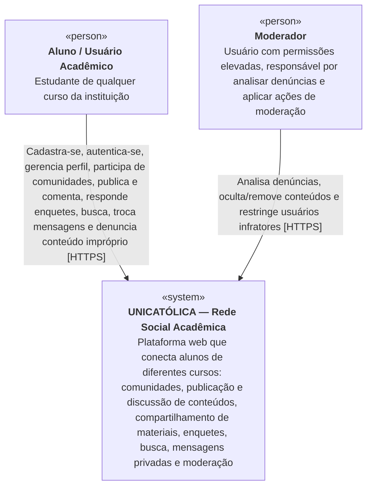
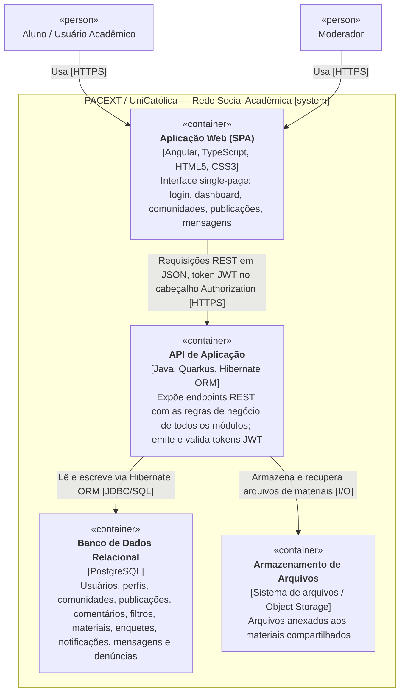
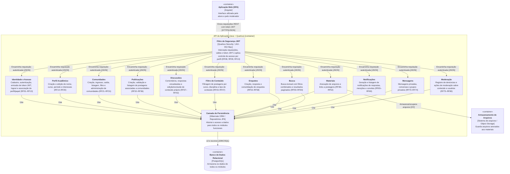
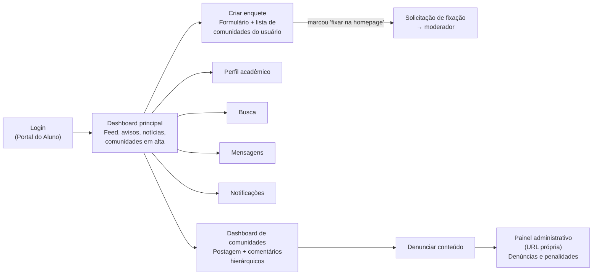

# UniCatólica — Rede Social Acadêmica

## 1. Problema e solução

Alunos da CatólicaSC enfrentam dificuldade de adaptação aos seus cursos. Foram identificados quatro fatores:

1. **Financeiro** — descartado do escopo por limitação do projeto.
2. **Social / networking e expectativa quanto ao curso** — mitigado permitindo que alunos interajam com estudantes de outros cursos, ampliando a rede de contatos e a percepção das opções da universidade.
3. **Dificuldade com aulas e relação com professores** — mitigado expondo opiniões e dicas de veteranos sobre disciplinas e professores, ajudando calouros.
4. **Burocracia em pesquisas de campo** (necessidade de repassar formulários a professores para distribuição em grupos de WhatsApp) — eliminada ao reunir os alunos em um único ambiente.

**Solução:** uma rede social acadêmica onde alunos de qualquer curso compartilham experiências, materiais, dúvidas e oportunidades em comunidades organizadas por curso, disciplina ou tema.

**Público beneficiado:** acadêmicos de universidades. O projeto amplia a visão sobre o próprio curso, incentiva interação entre áreas distintas e favorece o surgimento de projetos criativos antes do ingresso no mercado de trabalho.

## 2. Objetivos

**Geral:** construir um ambiente acadêmico para alunos de universidade com acesso facilitado a materiais de aprendizado e a grupos de alunos de outras áreas de graduação.

**Específicos:**
- Identificar um cliente cuja visão se alinhe ao projeto proposto.
- Coletar dados com o cliente definido para traçar o trajeto do projeto.
- Planejar um software de qualidade que atenda aos requisitos levantados, usando modelagem de dados, gestão de projetos e boas práticas atualizadas de desenvolvimento.

## 3. Requisitos funcionais

### 3.1 Identidade e acesso

| ID | Requisito |
|---|---|
| RF01 | Deve permitir cadastro com e-mail válido e senha |
| RF01.1 | Deve impedir o cadastro de usuários menores de 18 anos |
| RF02 | Deve impedir cadastro com e-mail já existente |
| RF03 | Deve validar formato de e-mail |
| RF04 | Deve validar política de senha |
| RF05 | Deve persistir usuário com perfil padrão |
| RF06 | Deve autenticar com credenciais válidas |
| RF07 | Deve rejeitar credenciais inválidas |
| RF08 | Deve gerar token/sessão ao autenticar |
| RF09 | Deve impedir acesso sem autenticação |
| RF10 | Deve permitir logout |
| RF11 | Deve invalidar sessão após logout |
| RF12 | Deve associar usuário a um perfil |
| RF13 | Deve restringir ações com base no perfil |

### 3.2 Perfil acadêmico

| ID | Requisito |
|---|---|
| RF14 | Deve permitir criar perfil acadêmico |
| RF15 | Deve permitir editar nome |
| RF16 | Deve permitir editar curso |
| RF17 | Deve permitir editar período |
| RF18 | Deve permitir adicionar interesses |
| RF19 | Deve persistir alterações do perfil |
| RF20 | Deve retornar perfil corretamente |
| RF20.1 | Deve emitir notificação para atualização de perfil do usuário |

### 3.3 Comunidades (Core)

| ID | Requisito |
|---|---|
| RF21 | Deve permitir criar comunidade |
| RF22 | Deve validar campos obrigatórios da comunidade |
| RF23 | Deve associar criador como administrador |
| RF24 | Deve permitir ingresso em comunidade |
| RF25 | Deve impedir ingresso duplicado |
| RF26 | Deve permitir saída da comunidade |
| RF27 | Deve listar comunidades |
| RF28 | Deve filtrar comunidades |
| RF29 | Deve permitir que o admin remova membros |
| RF30 | Deve permitir que o admin edite comunidades |
| RF31 | Deve permitir que o admin exclua comunidades |

### 3.4 Publicações

| ID | Requisito |
|---|---|
| RF32 | Deve permitir criar postagem |
| RF33 | Deve validar conteúdo obrigatório da postagem (papel de moderador) |
| RF34 | Deve associar postagem ao usuário |
| RF35 | Deve associar postagem à comunidade |
| RF36 | Deve listar postagens da comunidade |

### 3.5 Discussões

| ID | Requisito |
|---|---|
| RF37 | Deve permitir comentar em postagem |
| RF38 | Deve permitir responder comentário |
| RF39 | Deve permitir editar o próprio conteúdo |
| RF40 | Deve impedir edição de conteúdo de terceiros |
| RF41 | Deve permitir excluir conteúdo próprio |
| RF42 | Deve manter encadeamento de respostas |

### 3.6 Filtro de conteúdo

| ID | Requisito |
|---|---|
| RF43 | Deve permitir filtrar postagem por curso |
| RF44 | Deve permitir filtrar por disciplina |
| RF45 | Deve permitir filtrar por tipo de conteúdo |
| RF46 | Deve persistir filtragem |
| RF47 | Deve permitir filtrar por conteúdos |

### 3.7 Materiais

| ID | Requisito |
|---|---|
| RF48 | Deve permitir anexar arquivos (PNG/PDF/JPNG) |
| RF49 | Deve permitir anexar link |
| RF50 | Deve validar tipo de arquivo |
| RF51 | Deve associar material à postagem |
| RF52 | Deve permitir acesso ao material |

### 3.8 Enquetes e pesquisas

| ID | Requisito | Papel |
|---|---|---|
| RF53 | Deve permitir criar e fixar enquete na homepage | — (ver RF53.1 e RF53.2) |
| RF53.1 | Deve permitir que usuário autenticado crie enquete em comunidade da qual seja membro | Usuário membro |
| RF53.2 | Deve restringir a fixação de enquete na homepage ao papel de moderador | Moderador |
| RF53.3 | Deve impedir que um mesmo usuário mantenha mais de duas enquetes ativas por comunidade | Sistema |
| RF53.4 | Deve permitir que o criador solicite a fixação da enquete na homepage | Usuário membro |
| RF53.5 | Deve notificar o moderador ao receber solicitação de fixação | Sistema |
| RF53.6 | Deve notificar o autor sobre o deferimento ou indeferimento da solicitação de fixação | Sistema |
| RF54 | Deve permitir múltiplas opções | Criador da enquete |
| RF54.1 | Deve permitir que o criador defina, na criação, se a enquete é de escolha única ou múltipla | Criador da enquete |
| RF54.2 | Deve permitir que o criador defina o limite de opções selecionáveis em enquetes de escolha múltipla | Criador da enquete |
| RF54.3 | Deve exigir no mínimo duas e no máximo cinco opções por enquete | Sistema |
| RF55 | Deve permitir responder enquete | Usuário autenticado |
| RF55.1 | Deve restringir a votação em enquete não fixada aos membros da comunidade de origem | Sistema |
| RF55.2 | Deve permitir a votação em enquete fixada a qualquer usuário autenticado | Sistema |
| RF55.3 | Deve impedir a votação em enquete ocultada por moderação | Sistema |
| RF56 | Deve impedir seleção múltipla em enquetes de escolha única | Sistema |
| RF56.1 | Deve impedir que o mesmo usuário vote mais de uma vez na mesma enquete | Sistema |
| RF57 | Deve consolidar resultados | Sistema |
| RF57.1 | Deve consolidar resultados sem manter vínculo entre usuário e opção votada | Sistema |
| RF58 | Deve exibir resultados | Usuário autenticado, após votar ou após o encerramento |
| RF58.1 | Deve suprimir a exibição de resultados enquanto a enquete aberta tiver menos de 5 votos | Sistema |
| RF58.2 | Deve permitir o encerramento manual da enquete | Criador ou administrador |
| RF58.3 | Deve encerrar a enquete ao atingir a data de encerramento, quando definida na criação | Sistema |
| RF58.4 | Deve desafixar a enquete da homepage ao encerrá-la | Sistema |
| RF58.5 | Deve impedir a reabertura de enquete encerrada | Sistema |

#### Regras de votação

- Enquanto a enquete está aberta, os resultados só ficam visíveis ao usuário depois que ele registra o próprio voto (RF58).
- Após o encerramento, o resultado completo fica visível a todos os usuários autenticados, inclusive aos que não votaram — e independentemente do mínimo de 5 votos.
- O voto é irreversível: não há alteração de voto após o registro, e cada usuário vota uma única vez por enquete (RF56.1).
- Enquetes podem ser de escolha única ou múltipla, definido pelo criador; o limite de opções selecionáveis em enquetes múltiplas também é definido por ele.
- Cada enquete tem no mínimo 2 e no máximo 5 opções (RF54.3).
- Opções aceitam apenas texto no MVP. Não há opção de resposta aberta ("outro").
- **Escopo de votação:** enquete publicada em comunidade aceita voto apenas de membros dessa comunidade (RF55.1). Enquete fixada na homepage é uma **enquete da universidade** e aceita voto de qualquer usuário autenticado (RF55.2).
- Enquete ocultada por moderação para de aceitar votos, sem perder os já registrados (RF55.3).
- **Mínimo de 5 votos para exibir resultado** (RF58.1). O limiar é constante do sistema, não configurável pelo criador. Abaixo dele, quem já votou vê mensagem de espera com o total atual; quem não votou vê a tela normal de votação, já que o resultado não lhe seria exibido de qualquer forma.
- O criador da enquete vê apenas o agregado, nunca respostas individuais.

#### Encerramento

Prazo de encerramento é **opcional** na criação. O encerramento manual está sempre disponível para o criador e para administradores.

O estado "encerrada" é **derivado em tempo de leitura**, não persistido por job agendado:

```
encerrada = (encerrada_em != null) OR (data_encerramento != null AND data_encerramento < now())
```

A verificação ocorre tanto na leitura quanto na tentativa de voto, dispensando agendador e eliminando o risco de divergência entre o estado do banco e o tempo real. Não há reabertura (RF58.5).

#### Anonimato e modelo de votação

**Decisão: anonimato real, fixo para todas as enquetes** — não configurável pelo criador. O vínculo entre usuário e opção votada não existe no banco de dados.

Isso é obtido separando as duas informações em tabelas distintas, escritas na mesma transação:

```
enquete_participacao (enquete_id, usuario_id, votado_em)   -- garante RF56.1
   UNIQUE (enquete_id, usuario_id)

enquete_voto         (enquete_id, opcao_id)                -- o voto, sem dono
```

O RF56.1 exige saber **que** o usuário votou, não **o que** ele votou — daí a separação ser suficiente. A consolidação (RF57) conta linhas de `enquete_voto`.

**`enquete_voto` não guarda timestamp.** Se guardasse, a ordenação cruzada das duas tabelas permitiria reconstruir o vínculo, anulando o anonimato. Consequência aceita: não há análise de evolução temporal da votação. `enquete_participacao` mantém timestamp normalmente, pois não revela conteúdo de voto.

**Efeito jurídico:** votos assim armazenados são dado anonimizado e, pelo art. 12 da LGPD, ficam fora do escopo da lei — sem base legal a justificar, sem direito de acesso a atender, sem obrigação de eliminação, sem notificação de incidente sobre essa tabela. Atende ao RNF05 por design em vez de por processo.

Ressalvas conhecidas: `enquete_participacao` continua sendo dado pessoal (registra que a pessoa participou daquela enquete), e o enunciado da enquete é conteúdo publicado, sujeito a moderação como qualquer postagem.

**Exclusão de conta:** nenhuma ação necessária sobre os votos, já que não são atribuíveis a ninguém.

#### Auditoria de enquetes denunciadas ou removidas

Preserva-se o **enunciado, as opções, o autor, o resultado agregado e as ações de moderação** (RNF07). Não se preserva quem votou o quê — essa informação nunca existiu. O escopo é suficiente para tratar discurso ofensivo, que é o risco real do módulo.

#### Fluxo de criação

A criação parte de uma ação única na interface ("criar enquete", disponível no botão flutuante da barra lateral), que abre uma **página dedicada** contendo o formulário da enquete e a lista de comunidades das quais o usuário é membro.

- A lista apresenta apenas comunidades onde o usuário é membro (RF53.1) e sinaliza aquelas que já atingiram o limite de duas enquetes ativas (RF53.3).
- Se o usuário não é membro de nenhuma comunidade, a página exibe um botão para conhecer comunidades em vez do formulário.
- O formulário oferece a opção **"fixar na homepage"**. Marcada, a enquete é publicada normalmente na comunidade escolhida e a solicitação de fixação segue para o moderador (RF53.4, RF53.5); o autor é notificado da decisão (RF53.6).
- A publicação na comunidade **não depende** da decisão do moderador — apenas o destaque na homepage depende.

#### Interação com a moderação

| Ação | Efeito sobre a enquete | Reversível |
|---|---|---|
| Ocultar (RF78) | Sai do feed e para de aceitar votos; votos registrados são preservados | Sim (RF78.1) |
| Remover (RF79) | Encerra a enquete definitivamente | Não |

A ocultação é o estado de análise — usada enquanto a denúncia não foi julgada, inclusive durante o escalonamento a moderador neutro (RF80.1). A remoção é o veredito.

**Triagem prévia do agente (RF75.3):** ao detectar termo da blacklist no título ou nas opções, o agente **avisa o autor antes da publicação**, permitindo revisar ou confirmar. Confirmada, a enquete é publicada e sinalizada ao moderador (RF75.2). Esse desenho evita bloquear falsos positivos — termos como "violência" ou "suicídio" são legítimos em comunidades de Direito ou Saúde — sem introduzir pré-moderação.

#### Resultados não são segmentáveis

O resultado de qualquer enquete é um agregado único. Não há recorte por membro/não-membro, curso, período ou qualquer outro atributo.

Isso é consequência direta do modelo de anonimato, não uma limitação de interface. Segmentar exigiria gravar o atributo junto ao voto — e como `enquete_participacao` guarda as identidades de quem votou, qualquer atributo derivável da identidade cria um caminho de junção entre as duas tabelas. Exemplo: se três membros da comunidade participaram e três votos estão marcados como "de membro", o conjunto de suspeitos cai de centenas para três; se esses votos apontam à mesma opção, os votos individuais ficam expostos sem que nenhum bug tenha ocorrido.

> **Aviso para manutenção futura:** não adicionar coluna alguma a `enquete_voto`, especialmente `usuario_id`, `curso_id`, `periodo`, `era_membro` ou timestamp. Cada uma dessas colunas, isoladamente, anula a garantia do RF57.1 e devolve os votos ao escopo da LGPD. "Resultados por curso" é a funcionalidade que mais provavelmente será proposta e que mais claramente quebra o modelo.

Caminhos possíveis caso a segmentação venha a ser necessária, nenhum previsto para o MVP: aplicar limiar mínimo por segmento, verificando a interseção de todos os filtros combinados e não cada filtro isolado; ou coletar o atributo como pergunta dentro da própria enquete, mantendo-o no voto e não na identidade.

> As decisões desta seção foram tomadas em 2026-08-12, posteriormente ao relatório final de 03/07/2026. O texto do RF56 foi reescrito na mesma data: no original era "Deve impedir múltiplas respostas quando aplicável".

### 3.9 Busca

| ID | Requisito |
|---|---|
| RF59 | Deve buscar por texto |
| RF60 | Deve buscar usuários |
| RF61 | Deve buscar comunidades |
| RF62 | Deve buscar postagens |
| RF63 | Deve aplicar filtros combinados |
| RF64 | Deve retornar resultados paginados |

### 3.10 Notificações

| ID | Requisito |
|---|---|
| RF65 | Deve notificar resposta em postagem |
| RF66 | Deve notificar menção |
| RF67 | Deve notificar convite/enquete |
| RF68 | Deve permitir marcar notificação como lida |
| RF69 | Deve listar notificações do usuário |

### 3.11 Mensagens

| ID | Requisito |
|---|---|
| RF70 | Deve permitir enviar mensagem privada |
| RF71 | Deve receber mensagem |
| RF72 | Deve listar conversas |
| RF73 | Deve suportar grupos privados |
| RF74 | Deve persistir histórico de mensagens |

### 3.12 Moderação

| ID | Requisito |
|---|---|
| RF75 | Deve permitir denunciar conteúdo |
| RF75.1 | Deve alocar um agente inteligente para triagem de primeiro nível |
| RF75.2 | O agente deve notificar o moderador |
| RF75.3 | O agente deve analisar título e opções de enquete antes da publicação |
| RF76 | Deve registrar denúncia |
| RF77 | Moderador deve visualizar denúncias |
| RF78 | Moderador deve ocultar conteúdo |
| RF78.1 | Deve permitir que qualquer moderador ou administrador restaure conteúdo ocultado |
| RF79 | Moderador deve remover conteúdo |
| RF79.1 | Deve preservar registro de auditoria de conteúdo denunciado ou removido |
| RF80 | Moderador deve restringir usuário |
| RF80.1 | Deve permitir o escalonamento de denúncia a moderador neutro |

**Notas de moderação:**

- O escalonamento (RF80.1) existe porque os moderadores iniciais são representantes de turma, colegas dos usuários moderados; denúncias envolvendo pessoas da própria turma precisam de um moderador sem vínculo direto.
- A auditoria (RF79.1) preserva enunciado, autor, conteúdo, agregado e ações de moderação — nunca votos individuais de enquete, que não existem no modelo de dados.
- No MVP não há regra explícita proibindo conteúdo que nomeie pessoas. A blacklist de palavras do agente não detecta esse caso, que depende de denúncia e avaliação humana.
- Ao detectar termo da blacklist na triagem prévia (RF75.3), o agente avisa o autor e permite revisar ou confirmar a publicação; confirmada, a enquete vai ao ar sinalizada ao moderador. Não há bloqueio automático — ver seção 3.8.
- Ocultar (RF78) é reversível e é o estado de análise; remover (RF79) é definitivo. A restauração (RF78.1) não é exclusiva de quem ocultou — qualquer moderador ou administrador pode reverter, para que a análise não fique bloqueada pela ausência de uma pessoa específica.

## 4. Requisitos não funcionais

| ID | Categoria | Requisito | Norma/referência |
|---|---|---|---|
| RNF01 | Usabilidade | Usuário novo deve concluir login, entrada em comunidade e criação de postagem sem treinamento prévio | — |
| RNF02 | Responsividade | Interface deve operar corretamente em desktop e mobile browser, preservando integridade funcional nas principais jornadas | — |
| RNF03 | Desempenho | Operações críticas (navegação, autenticação, feed, abertura de comunidade) devem atender tempo de resposta p95 ≤ 2 s em carga acadêmica esperada | — |
| RNF04 | Segurança de aplicação | Baseline de segurança com autenticação segura, controle de acesso, validação de entrada, gestão de sessão e proteção contra falhas comuns de aplicação web | OWASP ASVS 4.0.3 (2021) |
| RNF05 | Privacidade | Tratamento de dados pessoais conforme finalidade, necessidade, transparência, controle de acesso e proteção do ciclo de vida dos dados | LGPD — Lei 13.709/2018 |
| RNF06 | Acessibilidade | Conformidade mínima com nível AA | WCAG 2.2 (W3C, 2023) |
| RNF07 | Auditabilidade | Registro de eventos relevantes de segurança e moderação: login, denúncia, remoção de conteúdo e alteração administrativa | — |
| RNF08 | Interoperabilidade de API | APIs HTTP do backend especificadas formalmente para documentação, validação contratual, geração de clientes e testes de contrato | OpenAPI 3.1.0 |
| RNF09 | Rastreabilidade de requisitos | Cada requisito deve ter identificador único, origem, prioridade, racional, critério de aceitação e vínculo com caso de uso, backlog e teste | ISO/IEC/IEEE 29148:2018 |

## 5. Stack tecnológica

| Camada | Tecnologias |
|---|---|
| Frontend | Angular; HTML, JavaScript/TypeScript, CSS |
| Backend | Java, Quarkus, Hibernate |
| Banco de dados | PostgreSQL |
| Autenticação | JWT |
| Ferramentas | Git, Figma, Postman, Confluence |

## 6. Arquitetura

A dimensão do projeto não justifica arquitetura de microsserviços. Optou-se por um **monólito multimodular conciso**, separado em dois projetos principais: frontend e backend.

- **TDD (Test Driven Development)** para implementar métodos e classes segundo os princípios **SOLID**, tornando-os compatíveis com testes automatizados e CI/CD.
- **DDD (Domain Driven Design)** com foco no núcleo do projeto — a interação da comunidade entre si — garantindo experiência fluida e interativa, conforme RNF01, RNF02 e RNF03.

### 6.1 C4 — Nível 1: Contexto



### 6.2 C4 — Nível 2: Contêineres



### 6.3 C4 — Nível 3: Componentes da API de Aplicação

Todos os componentes de módulo são implementados como **JAX-RS Resource + Service**.



**Mapa componente → requisitos:**

| Componente | Requisitos |
|---|---|
| Identidade e Acesso | RF01–RF13 |
| Perfil Acadêmico | RF14–RF20 |
| Comunidades | RF21–RF31 |
| Publicações | RF32–RF36 |
| Discussões | RF37–RF42 |
| Filtro de Conteúdo | RF43–RF47 |
| Materiais | RF48–RF52 |
| Enquetes | RF53–RF58 |
| Busca | RF59–RF64 |
| Notificações | RF65–RF69 |
| Mensagens | RF70–RF74 |
| Moderação | RF75–RF80 |

## 7. Interfaces

Foram prototipadas 10 telas no Figma, usando as cores base da instituição para preservar a identidade visual e seguindo padrões modernos de design e UI/UX, tendo o portal G1 como referência de layout.

**Telas definidas:** login (Portal do Aluno), dashboard principal (feed com avisos, notícias em destaque, comunidades em alta e hashtags em tendência), dashboard de comunidades (publicação com comentários hierárquicos e ações de curtir/comentar/compartilhar) e painel administrativo isolado com URL própria, para visualização de denúncias e penalidades a usuários.



## 8. Mapeamento de riscos

13 riscos organizados em quatro categorias: **Pessoas e Comunicação** (R04, R05, R07, R08, R10), **Escopo e Planejamento** (R02, R12, R13), **Técnico** (R03, R09) e **Produto e Negócio** (R01, R06, R11).

| ID | Risco | Categoria | Prob./Impacto | Prioridade | Mitigação | Contingência |
|---|---|---|---|---|---|---|
| R01 | Não adoção do sistema | Produto e Negócio | Alta / Muito alto | Crítico | Foco em MVP e validação com usuários | Reposicionar o produto com base em feedback |
| R02 | Escopo superdimensionado | Escopo e Planejamento | Alta / Alto | Crítico | Definir MVP com escopo controlado | Reduzir funcionalidades não essenciais |
| R03 | Falha na integração com API | Técnico | Média / Alto | Crítico | Testar a API desde o início e usar mocks | Utilizar dados simulados ou alternativas |
| R04 | Falha na comunicação interna | Pessoas e Comunicação | Alta / Alto | Crítico | Reuniões frequentes e ferramentas de gestão | Reorganizar a equipe e redefinir tarefas |
| R05 | Falha na comunicação com o cliente | Pessoas e Comunicação | Não informado | — | — | — |
| R06 | Uso indevido da plataforma | Produto e Negócio | Não informado | Qualidade e Produto | Definir regras de uso e implementar denúncias | Remover conteúdos e aplicar sanções |
| R07 | Má gestão do tempo | Pessoas e Comunicação | Não informado | Execução | Uso de sprints e acompanhamento contínuo | Repriorizar tarefas |
| R08 | Falta de conhecimento técnico | Pessoas e Comunicação | Não informado | Técnico relevante | Compartilhamento de conhecimento e divisão de tarefas por especialidade | Simplificar a solução e buscar apoio externo |
| R09 | Problemas de arquitetura e performance | Técnico | Não informado | Técnico relevante | Adotar arquitetura simples e realizar testes básicos | Refatorar partes críticas |
| R10 | Superestimação da equipe | Pessoas e Comunicação | Não informado | Execução | Estimativas conservadoras | Ajustar cronograma e reduzir escopo |
| R11 | Custos de infraestrutura | Produto e Negócio | Baixa / Médio | Secundário | Utilizar serviços gratuitos | Reduzir consumo de recursos |
| R12 | Falta de métricas | Escopo e Planejamento | Não informado | Secundário | Definir métricas simples | Implementar coleta posteriormente |
| R13 | Qualidade final comprometida | Escopo e Planejamento | Não informado | Qualidade e Produto | Realizar testes e revisões | Corrigir rapidamente os principais problemas |

**Estratégia geral de gerenciamento:** foco em MVP, validação contínua, comunicação frequente, simplicidade técnica e capacidade de adaptação, principalmente por redução de escopo quando necessário.

## 9. Decisões de design validadas

Validação conduzida em apresentação formal ao orientador, módulo a módulo, cobrindo todos os grupos funcionais. Todos os módulos foram aprovados.

### 9.1 Propostas destacadas positivamente

- **Onboarding progressivo do perfil** — exigir preenchimento de interesses no cadastro sobrecarregaria o usuário e reduziria a taxa de adesão. O campo é opcional no início, com notificação-gatilho posterior incentivando o usuário a completar o perfil após já estar engajado (RF20.1). O orientador comparou a abordagem à coleta progressiva de dados usada por bancos no preenchimento do perfil de investidor.
- **Agente de IA para triagem de moderação** — agente de primeiro nível baseado em blacklist de palavras, que envia notificação ao moderador humano para a decisão final (RF75.1, RF75.2). O uso de IA foi formalizado como requisito do sistema por orientação do professor.
- **Enquetes fixadas nas comunidades** — resolvem a perda de informações no fluxo de grupos de mensagens instantâneas (problema recorrente no WhatsApp).

### 9.2 Decisões por módulo

| Módulo | Decisão |
|---|---|
| Perfil do estudante | Campos: nome, curso, período e interesses. Interesses opcionais no cadastro inicial |
| Comunidades | Comunidades segmentadas por curso (ex.: Engenharia de Software). Coordenador ou professor pode gerenciar a comunidade e adicionar colaboradores. Administradores removem membros e editam configurações |
| Postagens e comentários | Hierarquia de comentários com encadeamento de respostas, similar ao modelo do YouTube, permitindo identificar e rastrear conversas visualmente. Edição restrita estritamente ao conteúdo do próprio autor |
| Filtros de conteúdo | Separação e organização de postagens por assuntos ou categorias (ex.: Inteligência Artificial, Banco de Dados, Java) |
| Enquetes e anexos | Anexos em PDF, PNG e links externos. Enquetes fixadas criáveis por administradores e moderadores. *(Regra de criação revista em 2026-08-12 — ver seção 3.8)* |
| Busca | Busca geral abrangendo textos livres, usuários, comunidades e postagens |
| Moderação | Papel de moderador responsável por evitar discurso de ódio e validar conteúdos reportados. Sugestão do orientador: representantes de turma assumem inicialmente a função de moderadores |
| Lançamento | MVP direcionado inicialmente ao curso de Engenharia de Software, com escalabilidade gradual para toda a universidade. Foco inicial nos calouros, por serem mais receptivos a novas ferramentas e não terem vícios com o WhatsApp |

### 9.3 Correções aplicadas por orientação do professor

- Padronizar a escrita dos requisitos com verbos no imperativo, conforme convenções formais de Engenharia de Requisitos.
- Substituir o termo "classificação" por "filtro" na nomenclatura dos requisitos de organização de conteúdo.
- Atribuir explicitamente os requisitos de enquetes aos papéis de administrador e moderador.
- Formalizar o uso de Inteligência Artificial na moderação como requisito do sistema.

## 10. Referências normativas

- **BRASIL.** Lei nº 13.709/2018 — Lei Geral de Proteção de Dados Pessoais (LGPD). https://www.planalto.gov.br/ccivil_03/_ato2015-2018/2018/lei/l13709.htm
- **ISO/IEC/IEEE 29148:2018** — Systems and software engineering: Life cycle processes — Requirements engineering.
- **OpenAPI Initiative.** OpenAPI Specification 3.1.0 (2021). https://spec.openapis.org/oas/v3.1.0
- **OWASP.** Application Security Verification Standard (ASVS) 4.0.3 (2021). https://owasp.org/www-project-application-security-verification-standard
- **W3C.** Web Content Accessibility Guidelines (WCAG) 2.2 (2023). https://www.w3.org/TR/WCAG22

## 11. Notas de conversão

Observações sobre o documento original, mantidas para transparência:

- O sistema aparece como **UniCatólica** no corpo do relatório e como **PACEXT** no diagrama C4 de contêineres — trata-se do mesmo sistema.
- A stack define **Angular** como frontend, mas o banner do projeto descreve "10 telas HTML5 com CSS embutido" — provável referência aos protótipos, não à implementação.
- RF48 lista o formato "JPNG" no original; presumivelmente JPG/JPEG.
- RNF03 está redigido em primeira pessoa no original ("recomendo que...") e foi normalizado aqui para o padrão dos demais requisitos.
- **Conteúdo posterior ao relatório:** o relatório final de 03/07/2026 continha os requisitos RF01–RF80 mais quatro subitens (RF20.1, RF75.1, RF75.2 e o RF56.1 criado depois). Em 2026-08-12 foram acrescentados vinte e três subitens de detalhamento — RF01.1, RF53.1–RF53.6, RF54.1–RF54.3, RF55.1–RF55.3, RF57.1, RF58.1–RF58.5, RF75.3, RF78.1, RF79.1 e RF80.1 — e reescrito o RF56. Nenhum requisito numerado do original foi removido, de modo que a contagem de 80 continua válida. Todo o restante do documento é transcrição fiel do relatório.
- **Escopo das decisões de 2026-08-12:** permissão de criação de enquetes, encerramento, anonimato e modelo de votação, auditoria, restrição etária no cadastro e triagem prévia pelo agente de IA. Nenhuma foi submetida ao orientador — são decisões de equipe posteriores à validação acadêmica.
- Cinco pontos do módulo de enquetes seguem indefinidos e estão listados ao final da seção 3.8.
- A seção 3.8 ganhou uma coluna **Papel** por requisito, atendendo à orientação do professor de atribuir explicitamente os requisitos de enquetes aos papéis (seção 9.3) — o relatório original só fazia essa atribuição no título do grupo, o que contradizia o RF55, cujo ator é o aluno.
- **Terminologia padronizada:** o diagrama C4 de componentes nomeava o módulo de RF43–RF47 como "Classificação", e a descrição do banco de dados (nível 2) citava "classificações" entre os dados armazenados — ambos anteriores à correção do orientador (seção 9.3). Neste documento tudo foi padronizado para **"Filtro de Conteúdo"** / "filtros". Se os diagramas originais forem reutilizados, precisam da mesma atualização.
- Os três diagramas C4 foram transcritos dos arquivos-fonte em alta resolução, com rótulos, tecnologias e legendas de relacionamento fiéis ao original.
- Removidos do original: capa, ficha de aprovação, sumário, rodapés de página, legendas de figuras, seções 5 (Avaliação pelo público beneficiado) e 6 (Considerações finais/autoavaliação), Anexos 1–3 (capturas de tela do G1, Figma e Confluence) e referências não normativas (Figma, G1, Atlassian).
